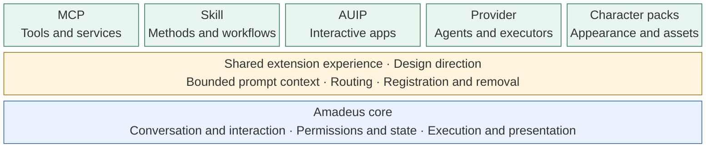

# Amadeus-Extensions

An open design space for extending [Amadeus](https://github.com/Code-Amadeus/Amadeus) with new capabilities, workflows, applications, and experiences.

> **Exploratory:** This repository shares our intentions. A public extension specification, API, and SDK have not yet been released.

## Integration direction

Amadeus already has several integration building blocks. We want to bring them into a consistent extension experience, with a small prompt footprint and predictable registration and removal.

The top row shows existing integration families. The shared middle layer is our intended direction, not a completed extension manager. Each family keeps its own role; a single extension may combine several of them.

## Where extensions fit

| Developer goal | Suggested integration | Initial opening direction |
| --- | --- | --- |
| Connect services, query data, or expose tools | MCP | First wave |
| Provide specialist methods, workflows, or templates | Skill | First wave |
| Build apps that collaborate with the character | AUIP | Application distribution to follow |
| Connect agents, execution engines, or dedicated executors | Provider adapter | Limited developer preview |
| Customize character appearance, scenes, or assets | Character-pack system, where supported | Separate asset specification |

This is an initial direction, not a release schedule or a statement that third-party access is available today.

## What matters most

- **Small prompt footprint.** Keep capability discovery concise and load detailed instructions only when needed.
- **Consistent routing.** Register capabilities through the existing routing system and withdraw them cleanly when disabled or removed.
- **Simple lifecycle.** Make installation, configuration, updates, and removal predictable, including what happens to active tasks and user data.
- **Controlled impact.** Keep extension failures and dependencies from disrupting the core experience, with explicit permissions and ownership.

Package formats, public interfaces, compatibility rules, and isolation mechanisms remain open. These goals will be refined through real integrations before becoming specification commitments.

## Join the discussion

Share use cases and feedback in [Discussions](https://github.com/Code-Amadeus/Amadeus-Extensions/discussions). We are especially interested in what you want to extend, what context it needs, and how it should behave when enabled or removed.
