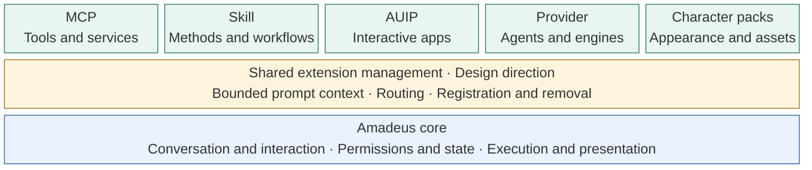

# Amadeus-Extensions

Exploring how developers can extend [Amadeus](https://github.com/Code-Amadeus/Amadeus) with new tools, workflows, applications, agents, and assets.

> **Exploratory:** The opening order and shared extension management below express our intentions. A public extension specification, API, and SDK have not yet been released.

## Extension paths

| Developer goal | Suggested integration | Opening direction |
| --- | --- | --- |
| Connect services, query data, or provide tools | MCP | First wave |
| Provide specialist methods, workflows, or templates | Skill | First wave |
| Build interactive apps that collaborate with the character | AUIP | Improve application distribution in a later phase |
| Connect a new agent or execution engine | Provider adapter | Limited developer preview |
| Customize character appearance, scenes, or assets | Existing character-pack system | Maintain a separate asset specification |

## Integration direction

The integration families already exist; a unified extension layer remains a design goal. Each family keeps its own role, and an extension may combine several of them.

Share ideas and use cases in [Discussions](https://github.com/Code-Amadeus/Amadeus-Extensions/discussions).
